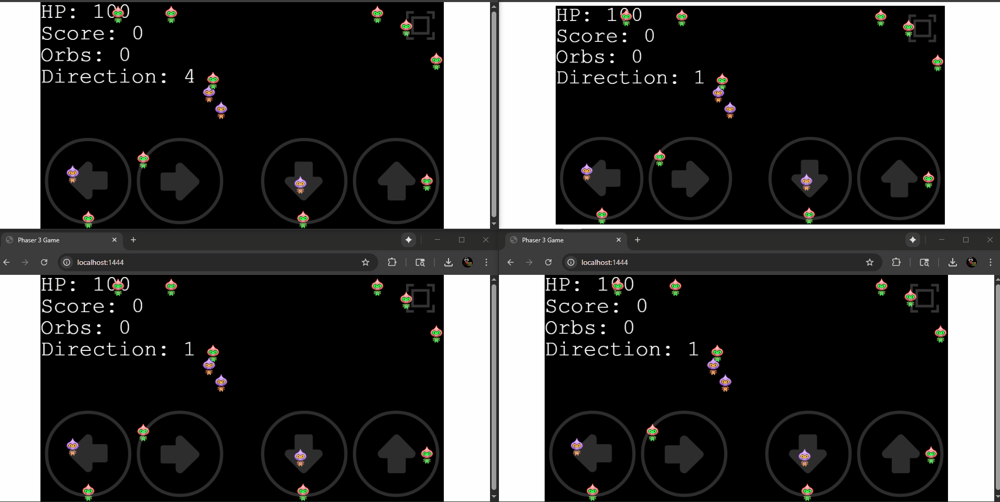

# Soul Collector with geckos.io

## How To Start

To clone and run this game, you'll need [Git](https://git-scm.com) and [Node.js](https://nodejs.org/en/download/) (which comes with [npm](http://npmjs.com)) installed on your computer. From your command line:

**Note:** Test it on Chrome. On some browsers like Firefox you need to add a STUN server to make it work.



```bash
# Clone this repository
$ npx gitget https://github.com/jebarpg/soulcollector soulcollector

# Go into the repository
$ cd soulcollector

# Install dependencies
$ npm install

# Start the local development server (on port 1444)
$ npm run start

go to http://localhost:1444
```
